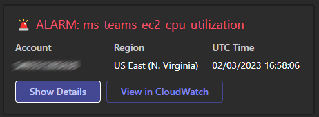
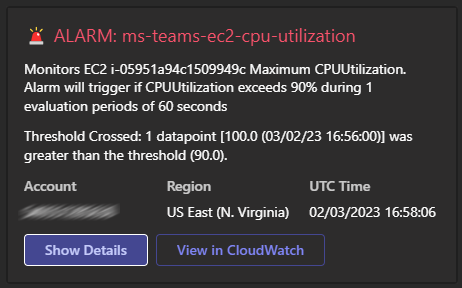
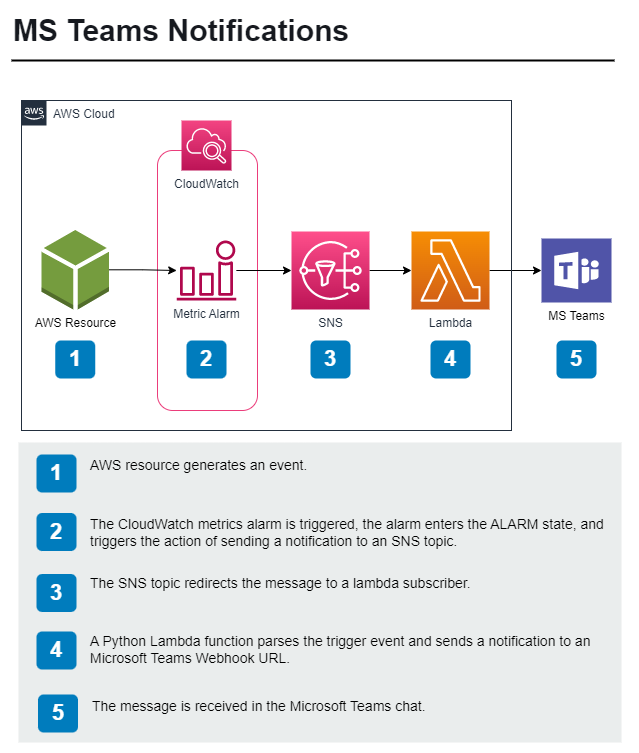

# Terraform AWS Microsoft Teams Notifications

Terraform Module to sends notification from CloudWatch to Microsoft Teams. This terraform module creates a Python Lambda function that sends notifications to Microsoft Teams. The Lambda function is triggered by a CloudWatch Event Rule. And sends the following types of notifications to Microsoft Teams:

**OK**

**ALARM**

**ALARM Details**

## Key features of the lambda function

- Works with all types of CloudWatch alarms, as long as the notification is sent to the SNS topic that this module creates.
- Dynamically changes the color of the notification based on the CloudWatch state.
- Dynamically changes the emoji of the notification based on the CloudWatch state.
- Dynamically grabs the CloudWatch description and details to use in the notification.
- Dynamically generates the CloudWatch ALARM url, so the user can click the "View in CloudWatch" button and go directly to the alarm details.

## Solution Diagram

<!-- BEGINNING OF PRE-COMMIT-TERRAFORM DOCS HOOK -->
README.md updated successfully
<!-- END OF PRE-COMMIT-TERRAFORM DOCS HOOK -->