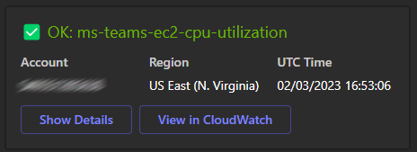

# Terraform AWS Microsoft Teams Notifications

Terraform Module to sends notification from CloudWatch to Microsoft Teams. This terraform module creates a Python Lambda function that sends notifications to Microsoft Teams. The Lambda function is triggered by a CloudWatch Event Rule. And sends the following types of notifications to Microsoft Teams:

**OK**

**ALARM**

**ALARM Details**

## Key features of the lambda function

- Works with all types of CloudWatch alarms, as long as the notification is sent to the SNS topic that this module creates.
- Dynamically changes the color of the notification based on the CloudWatch state.
- Dynamically changes the emoji of the notification based on the CloudWatch state.
- Dynamically grabs the CloudWatch description and details to use in the notification.
- Dynamically generates the CloudWatch ALARM url, so the user can click the "View in CloudWatch" button and go directly to the alarm details.

## Solution Diagram

<!-- BEGINNING OF PRE-COMMIT-TERRAFORM DOCS HOOK -->
## Requirements

| Name | Version |
|------|---------|
|  [terraform](#requirement\_terraform) | >= 1.0 |
|  [archive](#requirement\_archive) | >= 2.0.0 |
|  [aws](#requirement\_aws) | >= 4.0.0 |

## Providers

| Name | Version |
|------|---------|
|  [archive](#provider\_archive) | 2.4.0 |
|  [aws](#provider\_aws) | 5.5.0 |

## Modules

No modules.

## Resources

| Name | Type |
|------|------|
| [aws_iam_policy.ms_teams_notifications](https://registry.terraform.io/providers/hashicorp/aws/latest/docs/resources/iam_policy) | resource |
| [aws_iam_role.ms_teams_notifications](https://registry.terraform.io/providers/hashicorp/aws/latest/docs/resources/iam_role) | resource |
| [aws_iam_role_policy_attachment.ms_teams_notifications](https://registry.terraform.io/providers/hashicorp/aws/latest/docs/resources/iam_role_policy_attachment) | resource |
| [aws_lambda_function.ms_teams_notifications](https://registry.terraform.io/providers/hashicorp/aws/latest/docs/resources/lambda_function) | resource |
| [aws_lambda_permission.sns](https://registry.terraform.io/providers/hashicorp/aws/latest/docs/resources/lambda_permission) | resource |
| [aws_sns_topic.ms_teams_notifications](https://registry.terraform.io/providers/hashicorp/aws/latest/docs/resources/sns_topic) | resource |
| [aws_sns_topic_subscription.ms_teams_notifications](https://registry.terraform.io/providers/hashicorp/aws/latest/docs/resources/sns_topic_subscription) | resource |
| [aws_ssm_parameter.ms_teams_webhook_url](https://registry.terraform.io/providers/hashicorp/aws/latest/docs/resources/ssm_parameter) | resource |
| [archive_file.ms_teams_notifications](https://registry.terraform.io/providers/hashicorp/archive/latest/docs/data-sources/file) | data source |
| [aws_caller_identity.current](https://registry.terraform.io/providers/hashicorp/aws/latest/docs/data-sources/caller_identity) | data source |
| [aws_iam_policy_document.ms_teams_notifications_assume](https://registry.terraform.io/providers/hashicorp/aws/latest/docs/data-sources/iam_policy_document) | data source |
| [aws_iam_policy_document.ms_teams_notifications_policy](https://registry.terraform.io/providers/hashicorp/aws/latest/docs/data-sources/iam_policy_document) | data source |
| [aws_region.current](https://registry.terraform.io/providers/hashicorp/aws/latest/docs/data-sources/region) | data source |

## Inputs

| Name | Description | Type | Default | Required |
|------|-------------|------|---------|:--------:|
|  [webhook\_url](#input\_webhook\_url) | [REQUIRED] The Incoming Webhook URL for the Teams Chat | `string` | n/a | yes |

## Outputs

| Name | Description |
|------|-------------|
|  [sns\_topic\_arn](#output\_sns\_topic\_arn) | The ARN of the SNS topic for MS Teams notifications |
<!-- END OF PRE-COMMIT-TERRAFORM DOCS HOOK -->